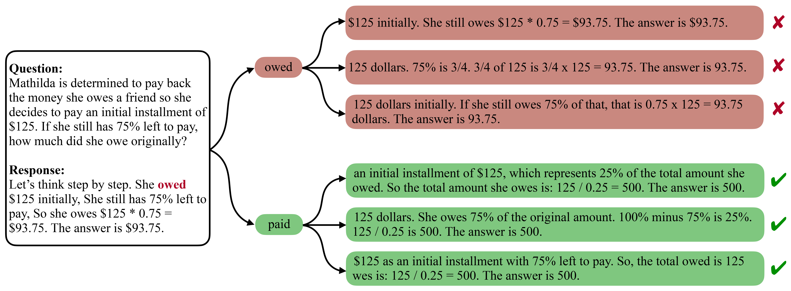
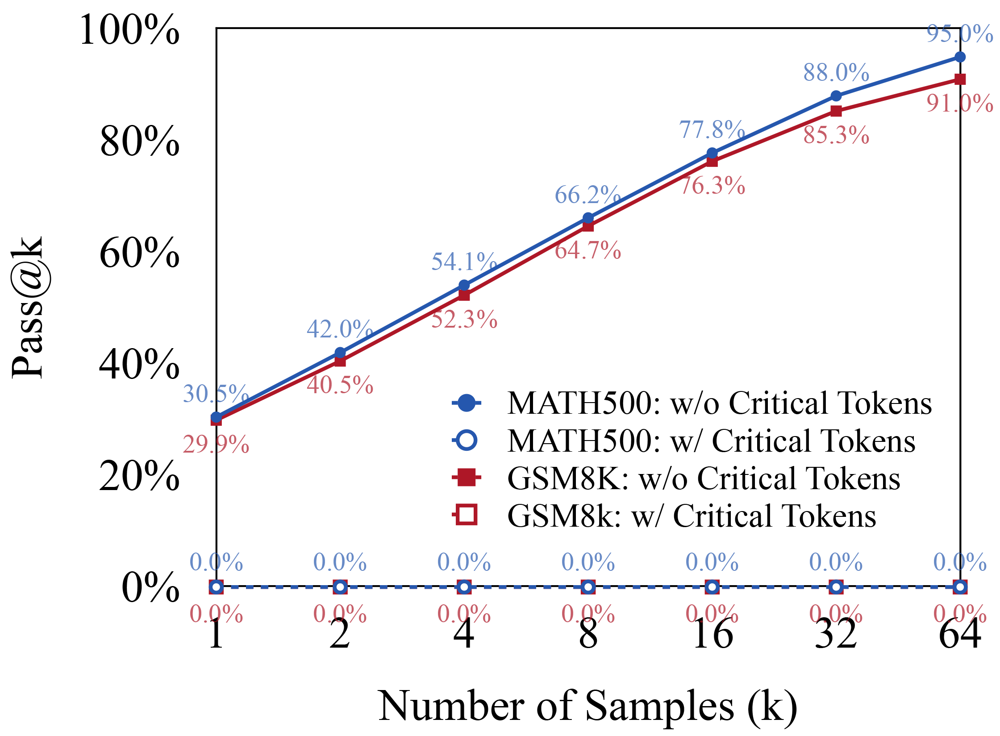

<h1 align="center">
Critical Tokens Matter:<br>
Token-Level Contrastive Estimation Enhances LLM's Reasoning Capability
</h1>

<div align="center">


</div>

<p align="center">
Repo for "<a href="https://arxiv.org/pdf/2411.19943" target="_blank">Critical Tokens Matter: Token-Level Contrastive Estimation Enhances LLM's Reasoning Capability</a>"
</p>

## 📣 Updates
- All the code from our [paper](https://arxiv.org/pdf/2411.19943) has been released.
- Accepted to ICML 2025 🎉🎉🎉
- Added support for Qwen2.5-7B/32B.
- Released [our training data](https://huggingface.co/datasets/Lin1557/Critical-Tokens-Matter-Train-Data). To train models, please download the data and move it to the ./data directory.

## 💡 Introduction
<div align=center>

<br>
<em>Figure 1: An illustration of the critical token "owed" shows that it fails to lead to the correct answer in any case. <br>Replacing it with an alternative can significantly increase model accuracy.</em>
</div>

Mathematical reasoning tasks pose significant challenges for large language models (LLMs) because they require precise logical deduction and sequence analysis. In this work, we introduce the concept of **critical tokens** -- elements within reasoning trajectories that significantly influence incorrect outcomes. We present a novel framework for identifying these tokens through rollout sampling and demonstrate their substantial divergence from traditional error tokens. Through extensive experiments on datasets such as GSM8K and MATH500, we show that identifying and replacing critical tokens significantly improves model accuracy. 

<div align=center>

<br>
<em>Figure 2: Impact of critical tokens on reasoning accuracy. Replacing critical tokens with alternatives ("w/o Critical Tokens")<br> can significantly increase model accuracy on both GSM8K and MATH500.</em>
</div>

We propose an efficient methodology for pinpointing these tokens in large-scale datasets using contrastive estimation and extend this framework to enhance model training processes with direct preference optimization (DPO). Experimental results on GSM8K and MATH500 benchmarks with the widely used models Llama-3 (8B and 70B) and Deepseek-math (7B) demonstrate the effectiveness of the proposed approach, cDPO. Our results underscore the potential of leveraging critical tokens to reduce errors in reasoning tasks, advancing the development of AI systems capable of robust logical deduction.

## 🚀 Quick Start
### ⚙️ Setup
**Cloning the repository**
```sh
git clone git@github.com:chenzhiling9954/Critical-Tokens-Matter.git
cd critical_token_release/src
```
**Preparing conda env**
```sh
conda create -n critical_token python=3.10
conda activate critical_token
pip install -r requirements.txt
```
### 🔨 Training
The training pipeline includes two major tasks: **Training for CE** and **Training for cDPO**. Both tasks use LoRA for training.
#### To train the CE model (which includes both the positive and negative models), run the following command:
```sh
gpus=<gpus>
export CUDA_VISIBLE_DEVICES=$gpus
python pipeline.py \
  --task_name train_ce \
  --model_name <model_name> \
  --dataset_name <dataset_name> \
  --gpus $gpus
```
#### To train the cDPO model, run the following command:
```sh
gpus=<gpus>
export CUDA_VISIBLE_DEVICES=$gpus
python pipeline.py \
  --task_name train_cdpo \
  --model_name <model_name> \
  --dataset_name <dataset_name> \
  --gpus $gpus
```
- The `model_name` can be one of the following options: `Meta-Llama-3-8B`, `Meta-Llama-3-70B`, or `deepseek-math-7b-base`.
- The `dataset_name` can be one of the following options: `GSM8K` or `MATH`.

### ⚖️ Evaluation
You can test the LoRA training results with the following command:
```sh
gpus=<gpus>
export CUDA_VISIBLE_DEVICES=$gpus
python pipeline.py \
    --task_name evaluation \
    --model_name <model_name> \
    --dataset_name <dataset_name> \
    --lora_path <lora_path>
    --gpus $gpus
```
Alternatively, to test an existing model, use the command below:
```sh
gpus=<gpus>
export CUDA_VISIBLE_DEVICES=$gpus
python pipeline.py \
    --task_name evaluation \
    --model_name <model_name> \
    --dataset_name <dataset_name> \
    --lora_path <lora_path> \
    --model_path <model_path>
    --gpus $gpus
```
- The `model_name` can be one of the following options: `Meta-Llama-3-8B`, `Meta-Llama-3-70B`, or `deepseek-math-7b-base`.
- The `dataset_name` can be one of the following options: `GSM8K` or `MATH`.


### 📱 Rollout sampling
In the Rollout Sampling process, we conducted 64 rollout samplings for each token within an incorrect trajectory. For each token, we calculated a score based on the correctness ratio of the generated completions to quantify its influence on the overall trajectory. The goal is to identify tokens that have a critical impact on the model's output.

```sh
gpus=<gpus>
export CUDA_VISIBLE_DEVICES=$gpus
python pipeline.py \
    --task_name sampling \
    --model_name <model_name> \
    --dataset_name <dataset_name> \
    --cdpo_data_path <cdpo_data_path> \
    --gpus $gpus
```
- The `model_name` can be one of the following options: `Meta-Llama-3-8B`, `Meta-Llama-3-70B`, or `deepseek-math-7b-base`.
- The `dataset_name` can be one of the following options: `GSM8K` or `MATH`.
- The `cdpo_data_path` specifies the source data path for sampling and should follow the format `./data/{model_name}/{dataset_name}.dpo_top_k{k}.T{t}.json.` For example, `./data/Meta-Llama-3-8B/GSM8K.dpo_top_k1.T0.50.json`.

After sampling, we check the results to calculate performance metrics such as "Pass@K", which helps quantify how effective the critical tokens are in influencing the model's predictions.


## ☕️ Citation
If you find this repository helpful, please consider citing our paper:

```
@article{lin2024critical,
  title={Critical Tokens Matter: Token-Level Contrastive Estimation Enhence LLM's Reasoning Capability},
  author={Lin, Zicheng and Liang, Tian and Xu, Jiahao and Wang, Xing and Luo, Ruilin and Shi, Chufan and Li, Siheng and Yang, Yujiu and Tu, Zhaopeng},
  journal={arXiv preprint arXiv:2411.19943},
  year={2024}
}
```